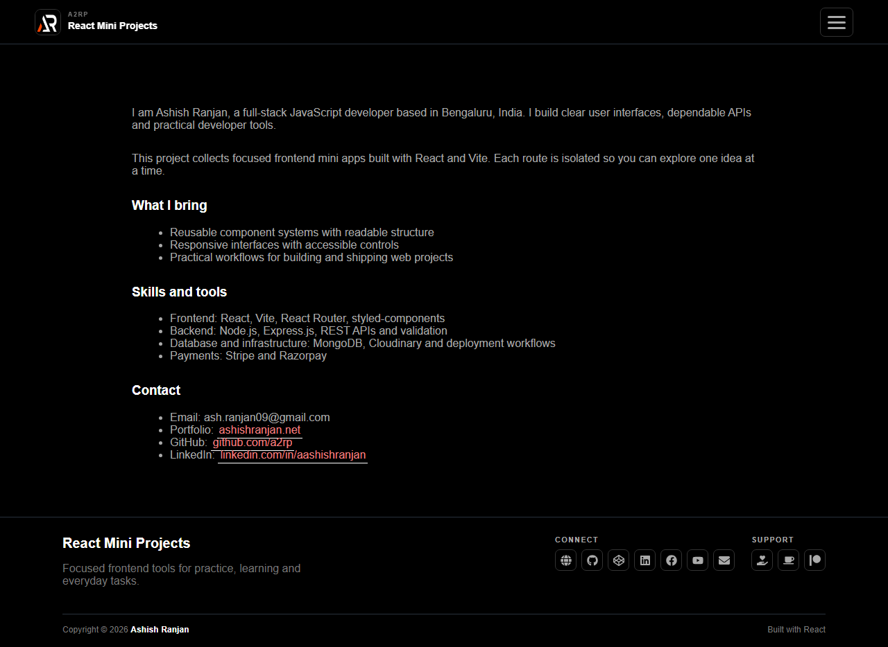

# React Mini Projects

A searchable collection of focused React mini projects and frontend tools. Each route is lazy-loaded and keeps its own UI logic so the apps can be explored independently.



## Features

- Searchable project navigation with keyboard focus using `/`
- Lazy-loaded routes for small tools, games and utilities
- Responsive fixed header, mobile slider menu and icon-only footer
- Browser-friendly interactions with independent app state
- GitHub Pages SPA deployment support

## Tech stack

React, React Router, Vite, styled-components, Material UI and react-icons.

## Run locally

```bash
npm install
npm run dev
```

Build and deploy:

```bash
npm run lint
npm run build
npm run deploy
```

Live: https://a2rp.github.io/react-mini-projects/

## Links

- Portfolio: https://www.ashishranjan.net/
- GitHub: https://github.com/a2rp
- CodePen: https://codepen.io/ash1198
- LinkedIn: https://www.linkedin.com/in/aashishranjan
- Facebook: https://www.facebook.com/theash.ashish/
- YouTube: https://www.youtube.com/@ashishranjan-ashz?sub_confirmation=1
- Email: mailto:ash.ranjan09@gmail.com

## Support

- Support: https://a2rp-donation-page.netlify.app/
- Buy Me a Coffee: https://buymeacoffee.com/a2rp
- Patreon: https://patreon.com/a2rp