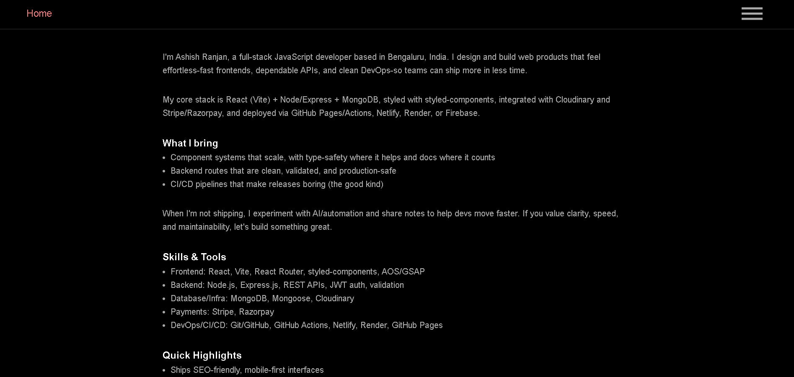

React Mini Projects (React + Vite)



---

Live: https://a2rp.github.io/react-mini-projects/

---

Production‑quality collection of frontend‑only React mini apps built with Vite and styled‑components - featuring a searchable gallery, lazy‑loaded routes, per‑app isolation, and GH Pages-friendly routing.

---

✨ Features

-   Searchable gallery (title, description, tags)
-   Lazy routes at scale: lazy components
-   Per‑app isolation: each app has its own Styled.Wrapper and assets (no CSS bleed)
-   GH Pages ready: BrowserRouter + SPA‑redirect
-   Clean UI: responsive cards grid, accessible focus states

---

🧱 Tech

-   React (Vite)
-   React Router
-   styled-components
-   MUI

---

🚀 Getting Started

```
# clone
git clone https://github.com/a2rp/react-mini-projects
cd react-mini-projects

# install
npm i


# dev
npm run dev


# build
npm run build


# preview production build
npm run preview
```
